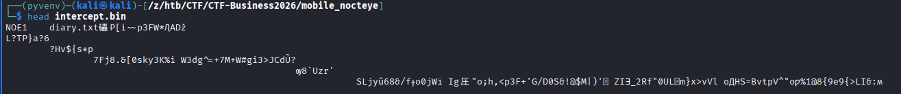

## Challenge description and content

> A field analyst's handset was compromised by a spyware implant — NoctEye. Before the SOC team could isolate the device, the implant encrypted a local log of stolen operational data and staged it for exfiltration. The team pulled the outgoing artifact — intercept.bin — before it left the device. The APK sample was also recovered from the filesystem. The encryption is entirely self-contained: no network calls, no cloud keys, no device fingerprint. Every parameter needed to decrypt intercept.bin is baked into either the DEX bytecode or the native library bundled with the APK. Reverse both. Recover the plaintext. Find the flag.

The zip contains two files, `nocteye.apk` and `intercept.bin`.
## Static analysis

We start by decompiling the APK with `jadx-gui`.

The `MainActivity` overrides the `onCreate` method, which will be called when the activity is started.

```java
public final class MainActivity extends AppCompatActivity {
    @Override // androidx.fragment.app.FragmentActivity, androidx.activity.ComponentActivity, androidx.core.app.ComponentActivity, android.app.Activity
    protected void onCreate(Bundle savedInstanceState) {
        super.onCreate(savedInstanceState);
        setContentView(C0309R.layout.activity_main);
        TextView textView = (TextView) findViewById(C0309R.id.status);
        try {
            File file = new File(getFilesDir(), "diary.txt");
            File file2 = new File(getFilesDir(), "intercept.bin");
            if (file.exists()) {
                CryptoOps.INSTANCE.encrypt(file, file2);
                textView.setText(getString(C0309R.string.status_run));
            }
        } catch (Throwable unused) {
        }
    }
}
```

We can see it calls `CryptoOps.INSTANCE.encrypt` with the two file paths `diary.txt` and `intercept.bin`. In this method we find the following encryption logic:

```java

public final class CryptoOps {
    private static final String CIPHER_ALGO = "AES/GCM/NoPadding";
    private static final int IV_LEN = 12;
    private static final int TAG_LEN_BITS = 128;
    public static final CryptoOps INSTANCE = new CryptoOps();
    private static final byte[] MAGIC = {78, 79, 69, 49};

    private CryptoOps() {
    }

    public final void encrypt(File input, File output) {
        Intrinsics.checkNotNullParameter(input, "input");
        Intrinsics.checkNotNullParameter(output, "output");
        String name = input.getName();
        Intrinsics.checkNotNull(name);
        SecretKeySpec secretKeySpec = new SecretKeySpec(Native.deriveKey(name), "AES");
        byte[] bArr = new byte[12];
        new SecureRandom().nextBytes(bArr);
        Cipher cipher = Cipher.getInstance(CIPHER_ALGO);
        cipher.init(1, secretKeySpec, new GCMParameterSpec(128, bArr));
        byte[] doFinal = cipher.doFinal(FilesKt.readBytes(input));
        byte[] bytes = name.getBytes(Charsets.UTF_8);
        Intrinsics.checkNotNullExpressionValue(bytes, "getBytes(...)");
        FileOutputStream fileOutputStream = new FileOutputStream(output);
        try {
            FileOutputStream fileOutputStream2 = fileOutputStream;
            fileOutputStream2.write(MAGIC);
            fileOutputStream2.write(new byte[]{(byte) bytes.length});
            fileOutputStream2.write(bytes);
            fileOutputStream2.write(bArr);
            fileOutputStream2.write(doFinal);
            Unit unit = Unit.INSTANCE;
            CloseableKt.closeFinally(fileOutputStream, null);
        } finally {
        }
    }
}
```

The `encrypt` method performs an encryption of the input file `diary.txt` with `AES/GCM/NoPadding`, where
* the key is determined as `Native.deriveKey("diary.txt")`.
* 12 random bytes are used as IV

In AES/GCM the finalized cipher output also contains an auth tag in the last 16 bytes, so the output file (`intercept.bin`,  which is given in the zip) will have the following structur:
* 4 btes `MAGIC`
* 1 byte: length of input filename, so `"diary.txt".length` which is 9
* 9 bytes: Input filename `"diary.txt"`
* 12 bytes IV
* encrypted file bytes + 16 bytes auth tag 

We verify the file path using `head`


The decrypt logic in python looks like this:

```python
from Crypto.Cipher import AES
HEX_MY_KEY = '???' # replace with correct key
key = bytes.fromhex(HEX_MY_KEY)
with open('intercept.bin', 'rb') as f:
  data = f.read()

# strip magic bytes, length and 'diary.txt'
data = data[14:]

cipher = AES.new(key, AES.MODE_GCM, data[:12]) # data[:12] is the IV
dec = cipher.decrypt_and_verify(data[12:-16],data[-16:]) # ciphertext, tag
print(dec.decode()) # decrypted file
```

Now we only have to find the key, which comes from `Native.deriveKey`, and like the name suggests it is in the native library:
```java
public final class Native {
    public static final Native INSTANCE = new Native();

    @JvmStatic
    public static final native byte[] deriveKey(String filename);

    private Native() {
    }

    static {
        System.loadLibrary("nocteye");
    }
}
```

This code tells us the method is bound via Java Native Functions `JNI` to the method `Java_com_nightfall_nocteye_Native_deriveKey` of the native library `libnocteye.so`. We find the lib in the Resources -> `/lib/arm64-v8a/libnocteye.so` and could also reverse that e.g. with Ghidra, but in this walkthrough I instead want to highlight a dynamic approach with [frida](https://github.com/frida/frida) where possible.
## Dynamically extracting the key with Frida
Instead of reversing the native library we can hook the method in frida and just check the return value. I used this hook: https://github.com/0x3xploit/frida-android-jni-hooking/blob/main/hook.js, which I needed to modify a bit to work with frida 17

```diff
@@ -39,9 +36,10 @@ Java.perform(function() {
     var library_loaded = false;
     var library_path = "";
 
-    Interceptor.attach(Module.findExportByName(null, "android_dlopen_ext"), {
+    Interceptor.attach(Module.findGlobalExportByName("android_dlopen_ext"), {
         onEnter: function(args) {
-            library_path = Memory.readCString(args[0]);
+            var pointer = new NativePointer(args[0]);
+            library_path = pointer.readCString();
             if (library_path.includes(library_name)) {
                 console.log("\n-------------------------------------------")
                 console.log(BLUE+"[~] Loading library : " + library_path+RESET);
@@ -75,7 +73,8 @@ Java.perform(function() {
                                         var length = env.getArrayLength(retval);
                                         console.log(GREEN+"[*]length of byteArray", length+RESET)
                                         var baseAddress = env.getByteArrayElements(retval, null);
-                                        var byteArray = Memory.readByteArray(baseAddress, length);
+                                        var pointer = new NativePointer(baseAddress)
+                                        var byteArray = pointer.readByteArray(length);
                                         console.log(GREEN+"[*]baseAddress  -->", baseAddress+RESET);
                                         console.log(BLUE+"[*]byteArray    \n", byteArray);
                                         console.log(""+RESET)
```

We also set our library and hook info at the top:
```js
    var library_name = "libnocteye.so"; // change these..!

    // Change these to your JNI function
    var function_names = [
        "Java_com_nightfall_nocteye_Native_deriveKey"
    ];
```

Final frida script:

```js
Java.perform(function() {
    var library_name = "libnocteye.so"; // change these..!

    // Change these to your JNI function
    var function_names = [
        "Java_com_nightfall_nocteye_Native_deriveKey"
    ];
    var RED = "\x1b[31m";
    var GREEN = "\x1b[32m";
    var BLUE = "\x1b[34m";
    var RESET = "\x1b[0m";
    var YELLOW = "\x1b[33m";
    console.log("\n-------------------------------------------")
    console.log(RED+`
⠀⠀⠀⢀⡤⢤⢄⣀⣀⠀⠀⠀⠀⠀⠀⠀⠀⠀⠀⠀⠀⠀⠀⠀⠀⠀⠀⠀⠀⠀⠀⠀⠀⠀⠀⠀⠀⠀
⠀⠀⠀⣼⡅⠠⢀⡈⢀⣙⣦⠀⠀⠀⠀⠀⠀⠀⠀⠀⠀⠀⠀⢀⣀⠤⠤⢤⣀⠀⠀⠀⠀⠀⠀⠀⠀⠀
⠀⠀⠀⢸⠀⠀⠀⠈⠙⠿⣝⢇⠀⠀⣀⣠⠤⠤⠤⠤⣤⡤⠚⠁⠀⠀⠀⠀⠀⠉⠢⡀⠀⠀⠀⠀⠀⠀
⠀⠀⠀⠀⢧⡀⠀⠀⠠⣄⠈⢺⣺⡍⠀⠀⠀⠀⣠⠖⠁⠀⠀⠀⠀⠀⠀⠀⠀⠀⠀⠘⡄⠀⠀⠀⠀⠀
⠀⠀⠀⠀⠸⡆⢀⠘⣔⠄⠑⠂⠈⠀⡔⠤⠴⠚⡁⠀⠀⢀⠀⠀⠀⣠⠔⢶⡢⡀⠀⠠⡇⠀⠀⠀⠀⠀
⠀⠀⠀⠀⢠⣇⠀⢃⡀⠁⠀⠀⠀⡸⠃⢀⡴⠊⢀⠀⠀⠈⢂⡤⠚⠁⠀⠀⠙⢿⠀⠉⡇⠀⠀⠀⠀⠀
⠀⠀⠀⣠⠾⣹⢤⢼⡆⠀⠀⠀⠀⠀⠀⠈⢀⠞⠁⠀⢠⣴⠏⠀⠀⠀⠀⠀⠀⠸⡇⠀⢇⠀⠀⠀⠀⠀
⠀⠀⣾⢡⣤⡈⠣⡀⠙⠒⠀⠀⠀⠀⣀⠤⠤⣤⠤⣌⠁⢛⡄⠀⠀⠀⠀⠀⠠⡀⢇⠀⠘⣆⠀⢀⡴⡆
⠀⠀⣿⢻⣿⣿⣄⡸⠀⡆⠀⠒⣈⣩⣉⣉⡈⠉⠉⠢⣉⠉⠀⠀⠀⠀⠀⠀⠀⢣⠈⠢⣀⠈⠉⢁⡴⠃
⠀⢀⢿⣿⣿⡿⠛⠁⠀⢻⣿⣿⣿⣿⣿⣿⣿⣷⣦⣄⣸⢿⠀⠀⠀⠀⠀⠀⠀⠸⡄⠀⡇⠉⠉⠁⠀⠀
⣠⣞⠘⢛⡛⢻⣷⣤⡀⠈⡎⣿⣿⣿⣿⣿⣿⣿⣿⣿⠹⠏⠀⠀⠀⠀⠀⠀⠀⠀⠇⢰⡇⠀⠀⠀⠀⠀
⠻⣌⠯⡁⢠⣸⣿⣿⣷⡄⠁⠈⢻⢿⣿⣿⣿⣿⠿⠋⠃⠰⣀⠀⠀⠀⠀⠀⠀⠀⠀⣾⠇⠀⠀⠀⠀⠀
⠀⠀⠉⢻⠨⠟⠹⢿⣿⢣⠀⠀⢨⡧⣌⠉⠁⣀⠴⠊⠑⠀⡸⠛⠀⠀⠀⠀⠀⣸⢲⡟⠀⠀⠀⠀⠀⠀
⠀⠀⣠⠏⠀⠀⠀⠉⠉⠁⠀⠐⠁⠀⠀⢉⣉⠁⠀⠀⢀⠔⢷⣄⠀⠀⠀⠀⢠⣻⡞⠀⠀⠀⠀⠀⠀⠀
⠀⢠⠟⡦⣀⣀⣀⠀⠀⠀⠀⠀⠀⠀⢾⠉⠀⣹⣦⠤⣿⣿⡟⠁⠀⠀⠀⢀⣶⠟⠀⠀⠀⠀⠀⠀⠀⠀
⠀⠈⠙⣦⣁⡎⢈⠏⢱⠚⢲⠔⢲⠲⡖⠖⣦⣿⡟⠀⣿⡿⠁⣠⢔⡤⠷⠋⠁⠀⠀⠀⠀⠀⠀⠀⠀⠀
⠀⠀⢿⣟⠿⡿⠿⠶⢾⠶⠾⠶⠾⠞⢻⠋⠏⣸⠁⠀⡽⠓⠚⠋⠁⠀⠀⠀⠀⠀⠀⠀⠀⠀⠀⠀⠀⠀
⠀⠀⢸⡏⠳⠷⠴⠣⠜⠢⠜⠓⠛⠊⠀⢀⡴⠣⠀⠀⡇⠀⠀⠀⠀⠀⠀⠀⠀⠀⠀⠀⠀⠀⠀⠀⠀⠀
⠀⠀⣏⠒⠀⠀⠀⠀⠀⠀⠀⠀⠀⠀⠊⠁⢀⣀⣀⠴⠃⠀⠀⠀⠀⠀⠀⠀⠀⠀⠀⠀⠀⠀⠀⠀⠀⠀
⠀⠀⠘⢦⡀⠀⠀⠀⠀⠀⠀⢀⣀⠴⠖⠒⠉⠁⠀⠀⠀⠀⠀⠀⠀⠀⠀⠀⠀⠀⠀⠀⠀⠀⠀⠀⠀⠀
⠀⠀⠀⠀⠉⠑⠒⠒⠐⠒⠛⠋⠀⠀⠀⠀⠀⠀⠀⠀⠀⠀⠀⠀`+RESET+BLUE+"3v1l JN1 H00k....!!"+RESET);
    var library_loaded = false;
    var library_path = "";

    Interceptor.attach(Module.findGlobalExportByName("android_dlopen_ext"), {
        onEnter: function(args) {
            var pointer = new NativePointer(args[0]);
            library_path = pointer.readCString();
            if (library_path.includes(library_name)) {
                console.log("\n-------------------------------------------")
                console.log(BLUE+"[~] Loading library : " + library_path+RESET);
                library_loaded = true;
            }
        },
        onLeave: function(args) {
            if (library_loaded) {
                console.log("\n-------------------------------------------")
                console.log(GREEN+"[+] Loaded library: " + library_path+RESET);
                var nativeLib = Module.load(library_path);

                function_names.forEach(function(function_name) {
                    var methodAddress = nativeLib.findExportByName(function_name);
                    if (methodAddress) {
                        console.log(GREEN+"[*]Function name: " + function_name+RESET);
                        console.log(YELLOW+"[*]Native method address: " + methodAddress.toString()+RESET);

                        Interceptor.attach(methodAddress, {
                            onEnter: function(args) {
                                console.log("\n----------------------------------------------------------")
                                console.log(GREEN+"[*]Calling " + function_name+RESET);
                            },
                            onLeave: function(retval) {
                                try {
                                    var env = Java.vm.getEnv();

                                    if (env.isInstanceOf(retval, env.findClass("[B"))) {
                                        // Handle byte array

                                        var length = env.getArrayLength(retval);
                                        console.log(GREEN+"[*]length of byteArray", length+RESET)
                                        var baseAddress = env.getByteArrayElements(retval, null);
                                        var pointer = new NativePointer(baseAddress)
                                        var byteArray = pointer.readByteArray(length);
                                        console.log(GREEN+"[*]baseAddress  -->", baseAddress+RESET);
                                        console.log(BLUE+"[*]byteArray    \n", byteArray);
                                        console.log(""+RESET)

                                        // Release byte array elements
                                        env.releaseByteArrayElements(retval, baseAddress, 0);
                                    } else if (env.isInstanceOf(retval, env.findClass('java/lang/String'))) {
                                        // Handle Java String
                                        var stringValue = env.getStringUtfChars(retval, null).readCString();
                                        console.log(YELLOW+"[*]Return value is a string: " + stringValue+RESET);
                                    }else
                                        {
                                        // Handle other types or default case
                                        console.log(RED+"[!]Return value is of unknown type: " + retval+RESET);
                                    }
                                } catch (error) {
                                    console.log(RED+"[!]Error handling return value: " + error.message+RESET);
                                    console.log(RED+"[!]Raw return value: " + retval+RESET);
                                }
                            }
                        });
                    } else {
                        console.log(RED+"[!]Function name: " + function_name + " not found."+RESET);
                    }
                });
                library_loaded = false;
            }
        }
    });
});
```

Now we also need to ensure that there is a diary.txt

```shell
┌──(.mobile-venv)─(kali㉿kali)-[/z/htb/CTF/CTF-Business2026/mobile_nocteye]
└─$ adb shell
daisy_sprout:/ $ su
daisy_sprout:/ # cd /data/data/com.nightfall.nocteye/files
daisy_sprout:/data/data/com.nightfall.nocteye/files # ls -la 
total 20
drwxrwx--x 2 u0_a167 u0_a167 4096 2026-05-25 11:33 .
drwx------ 5 u0_a167 u0_a167 4096 2026-05-16 08:14 ..
-rw------- 1 u0_a167 u0_a167   24 2026-05-25 11:30 profileInstalled
-rw------- 1 u0_a167 u0_a167    8 2026-05-16 08:15 profileinstaller_profileWrittenFor_lastUpdateTime.dat
daisy_sprout:/data/data/com.nightfall.nocteye/files # touch diary.txt
daisy_sprout:/data/data/com.nightfall.nocteye/files # ls -la
total 20
drwxrwx--x 2 u0_a167 u0_a167 4096 2026-05-25 11:34 .
drwx------ 5 u0_a167 u0_a167 4096 2026-05-16 08:14 ..
-rw-r--r-- 1 root    root       0 2026-05-25 11:34 diary.txt
-rw------- 1 u0_a167 u0_a167   24 2026-05-25 11:30 profileInstalled
-rw------- 1 u0_a167 u0_a167    8 2026-05-16 08:15 profileinstaller_profileWrittenFor_lastUpdateTime.dat

```

Now we run the app with the hook attached:

```shell
┌──(.mobile-venv)─(kali㉿kali)-[/mnt/…/htb/CTF/CTF-Business2026/mobile_nocteye]
└─$ frida -l ./hook-deriveKey.js -U -f com.nightfall.nocteye
     ____
    / _  |   Frida 17.9.1 - A world-class dynamic instrumentation toolkit
   | (_| |
    > _  |   Commands:
   /_/ |_|       help      -> Displays the help system
   . . . .       object?   -> Display information about 'object'
   . . . .       exit/quit -> Exit
   . . . .
   . . . .   More info at https://frida.re/docs/home/
   . . . .
   . . . .   Connected to Mi A2 Lite (id=192.168.178.54:5555)
Spawned `com.nightfall.nocteye`. Resuming main thread!
[Mi A2 Lite::com.nightfall.nocteye ]->
-------------------------------------------

⠀⠀⠀⢀⡤⢤⢄⣀⣀⠀⠀⠀⠀⠀⠀⠀⠀⠀⠀⠀⠀⠀⠀⠀⠀⠀⠀⠀⠀⠀⠀⠀⠀⠀⠀⠀⠀⠀
⠀⠀⠀⣼⡅⠠⢀⡈⢀⣙⣦⠀⠀⠀⠀⠀⠀⠀⠀⠀⠀⠀⠀⢀⣀⠤⠤⢤⣀⠀⠀⠀⠀⠀⠀⠀⠀⠀
⠀⠀⠀⢸⠀⠀⠀⠈⠙⠿⣝⢇⠀⠀⣀⣠⠤⠤⠤⠤⣤⡤⠚⠁⠀⠀⠀⠀⠀⠉⠢⡀⠀⠀⠀⠀⠀⠀
⠀⠀⠀⠀⢧⡀⠀⠀⠠⣄⠈⢺⣺⡍⠀⠀⠀⠀⣠⠖⠁⠀⠀⠀⠀⠀⠀⠀⠀⠀⠀⠘⡄⠀⠀⠀⠀⠀
⠀⠀⠀⠀⠸⡆⢀⠘⣔⠄⠑⠂⠈⠀⡔⠤⠴⠚⡁⠀⠀⢀⠀⠀⠀⣠⠔⢶⡢⡀⠀⠠⡇⠀⠀⠀⠀⠀
⠀⠀⠀⠀⢠⣇⠀⢃⡀⠁⠀⠀⠀⡸⠃⢀⡴⠊⢀⠀⠀⠈⢂⡤⠚⠁⠀⠀⠙⢿⠀⠉⡇⠀⠀⠀⠀⠀
⠀⠀⠀⣠⠾⣹⢤⢼⡆⠀⠀⠀⠀⠀⠀⠈⢀⠞⠁⠀⢠⣴⠏⠀⠀⠀⠀⠀⠀⠸⡇⠀⢇⠀⠀⠀⠀⠀
⠀⠀⣾⢡⣤⡈⠣⡀⠙⠒⠀⠀⠀⠀⣀⠤⠤⣤⠤⣌⠁⢛⡄⠀⠀⠀⠀⠀⠠⡀⢇⠀⠘⣆⠀⢀⡴⡆
⠀⠀⣿⢻⣿⣿⣄⡸⠀⡆⠀⠒⣈⣩⣉⣉⡈⠉⠉⠢⣉⠉⠀⠀⠀⠀⠀⠀⠀⢣⠈⠢⣀⠈⠉⢁⡴⠃
⠀⢀⢿⣿⣿⡿⠛⠁⠀⢻⣿⣿⣿⣿⣿⣿⣿⣷⣦⣄⣸⢿⠀⠀⠀⠀⠀⠀⠀⠸⡄⠀⡇⠉⠉⠁⠀⠀
⣠⣞⠘⢛⡛⢻⣷⣤⡀⠈⡎⣿⣿⣿⣿⣿⣿⣿⣿⣿⠹⠏⠀⠀⠀⠀⠀⠀⠀⠀⠇⢰⡇⠀⠀⠀⠀⠀
⠻⣌⠯⡁⢠⣸⣿⣿⣷⡄⠁⠈⢻⢿⣿⣿⣿⣿⠿⠋⠃⠰⣀⠀⠀⠀⠀⠀⠀⠀⠀⣾⠇⠀⠀⠀⠀⠀
⠀⠀⠉⢻⠨⠟⠹⢿⣿⢣⠀⠀⢨⡧⣌⠉⠁⣀⠴⠊⠑⠀⡸⠛⠀⠀⠀⠀⠀⣸⢲⡟⠀⠀⠀⠀⠀⠀
⠀⠀⣠⠏⠀⠀⠀⠉⠉⠁⠀⠐⠁⠀⠀⢉⣉⠁⠀⠀⢀⠔⢷⣄⠀⠀⠀⠀⢠⣻⡞⠀⠀⠀⠀⠀⠀⠀
⠀⢠⠟⡦⣀⣀⣀⠀⠀⠀⠀⠀⠀⠀⢾⠉⠀⣹⣦⠤⣿⣿⡟⠁⠀⠀⠀⢀⣶⠟⠀⠀⠀⠀⠀⠀⠀⠀
⠀⠈⠙⣦⣁⡎⢈⠏⢱⠚⢲⠔⢲⠲⡖⠖⣦⣿⡟⠀⣿⡿⠁⣠⢔⡤⠷⠋⠁⠀⠀⠀⠀⠀⠀⠀⠀⠀
⠀⠀⢿⣟⠿⡿⠿⠶⢾⠶⠾⠶⠾⠞⢻⠋⠏⣸⠁⠀⡽⠓⠚⠋⠁⠀⠀⠀⠀⠀⠀⠀⠀⠀⠀⠀⠀⠀
⠀⠀⢸⡏⠳⠷⠴⠣⠜⠢⠜⠓⠛⠊⠀⢀⡴⠣⠀⠀⡇⠀⠀⠀⠀⠀⠀⠀⠀⠀⠀⠀⠀⠀⠀⠀⠀⠀
⠀⠀⣏⠒⠀⠀⠀⠀⠀⠀⠀⠀⠀⠀⠊⠁⢀⣀⣀⠴⠃⠀⠀⠀⠀⠀⠀⠀⠀⠀⠀⠀⠀⠀⠀⠀⠀⠀
⠀⠀⠘⢦⡀⠀⠀⠀⠀⠀⠀⢀⣀⠴⠖⠒⠉⠁⠀⠀⠀⠀⠀⠀⠀⠀⠀⠀⠀⠀⠀⠀⠀⠀⠀⠀⠀⠀
⠀⠀⠀⠀⠉⠑⠒⠒⠐⠒⠛⠋⠀⠀⠀⠀⠀⠀⠀⠀⠀⠀⠀⠀3v1l JN1 H00k....!!

-------------------------------------------
[~] Loading library : /data/app/com.nightfall.nocteye-j7aljGRqFB-tOQhDktaJfQ==/base.apk!/lib/arm64-v8a/libnocteye.so

-------------------------------------------
[+] Loaded library: /data/app/com.nightfall.nocteye-j7aljGRqFB-tOQhDktaJfQ==/base.apk!/lib/arm64-v8a/libnocteye.so
[*]Function name: Java_com_nightfall_nocteye_Native_deriveKey
[*]Native method address: 0x7499da192c

----------------------------------------------------------
[*]Calling Java_com_nightfall_nocteye_Native_deriveKey
[*]length of byteArray 32
[*]baseAddress  --> 0x74f8403480
[*]byteArray
            0  1  2  3  4  5  6  7  8  9  A  B  C  D  E  F  0123456789ABCDEF
00000000  2e bf de 33 fe 94 53 c0 95 9b eb 65 dc d1 d2 28  ...3..S....e...(
00000010  01 34 bb f6 f9 71 a6 00 12 f8 5c 40 3b 48 87 d8  .4...q....\@;H..
```

=> We successfully extracted the key and can use it in the python script:
```python
from Crypto.Cipher import AES
HEX_MY_KEY = '2ebfde33fe9453c0959beb65dcd1d2280134bbf6f971a60012f85c403b4887d8'
key = bytes.fromhex(HEX_MY_KEY)
with open('intercept.bin', 'rb') as f:
  data = f.read()

# strip magic bytes, length and 'diary.txt'
data = data[14:]

cipher = AES.new(key, AES.MODE_GCM, data[:12]) # data[:12] is the IV
dec = cipher.decrypt_and_verify(data[12:-16],data[-16:]) # ciphertext, tag
print(dec.decode()) # decrypted file
```

```shell
┌──(pyvenv)─(kali㉿kali)-[/mnt/…/htb/CTF/CTF-Business2026/mobile_nocteye]
└─$ python decrypt.py
== NoctEye intercept log v1 ==
[2026-04-17 23:02:11] chat/signal thread:ops-alpha msg:"move to safehouse 7"
[2026-04-18 11:48:03] contact:K.Vega +XX-XXX-XXXX
[2026-04-19 02:14:07] location:52.2297N,21.0122E
[2026-04-19 18:33:42] chat/signal thread:ops-alpha msg:"extraction confirmed"
[2026-04-20 09:12:55] note:self HTB{n0ct3y3_p4ssphr4s3_pl5_f1l3n4m3_k3y}
[2026-04-21 00:42:55] location:REDACTED
== end intercept ==
```