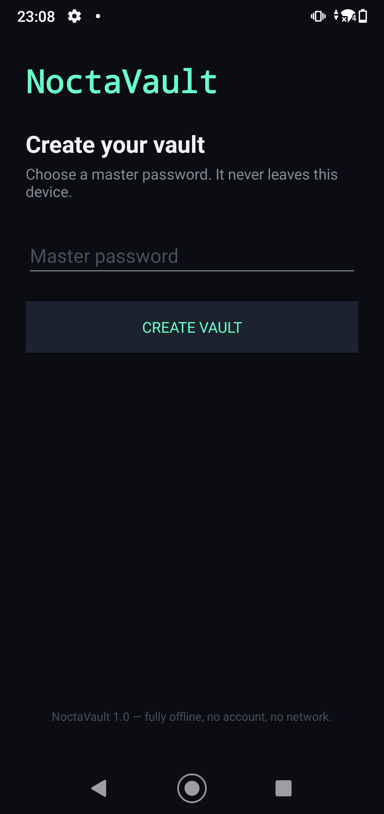
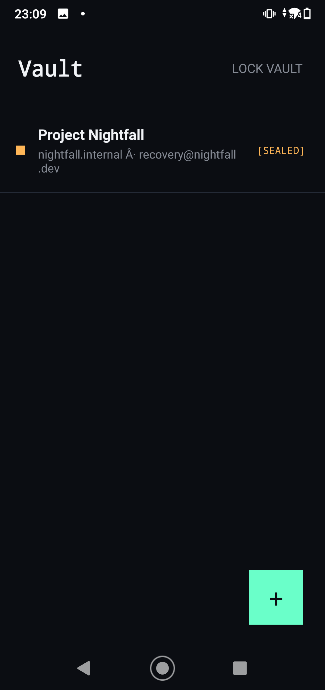
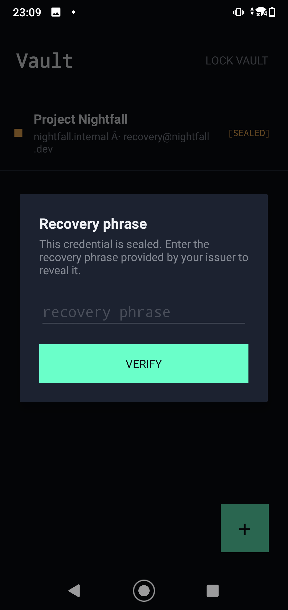
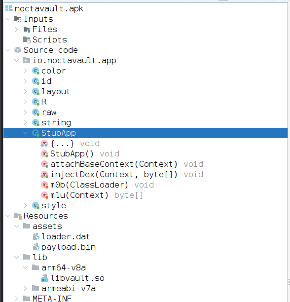
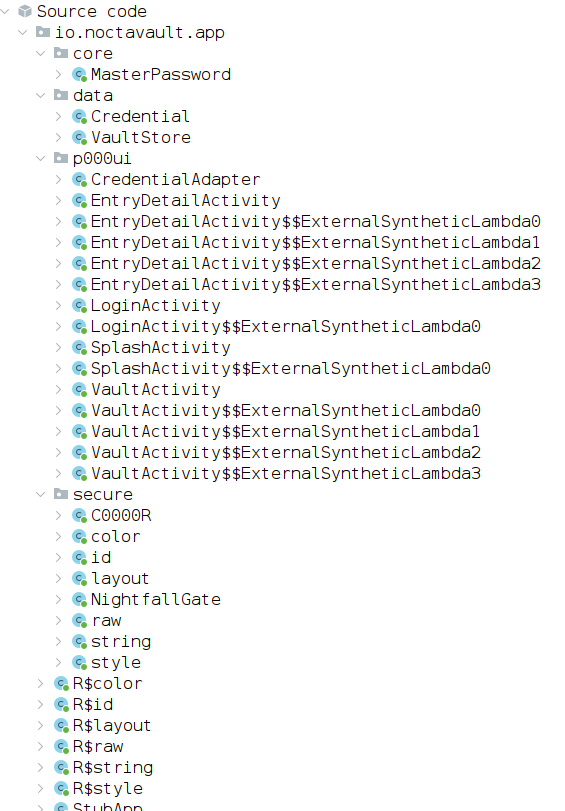
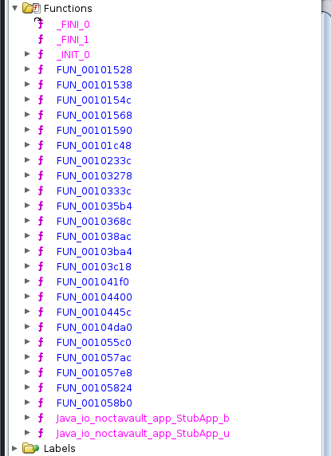
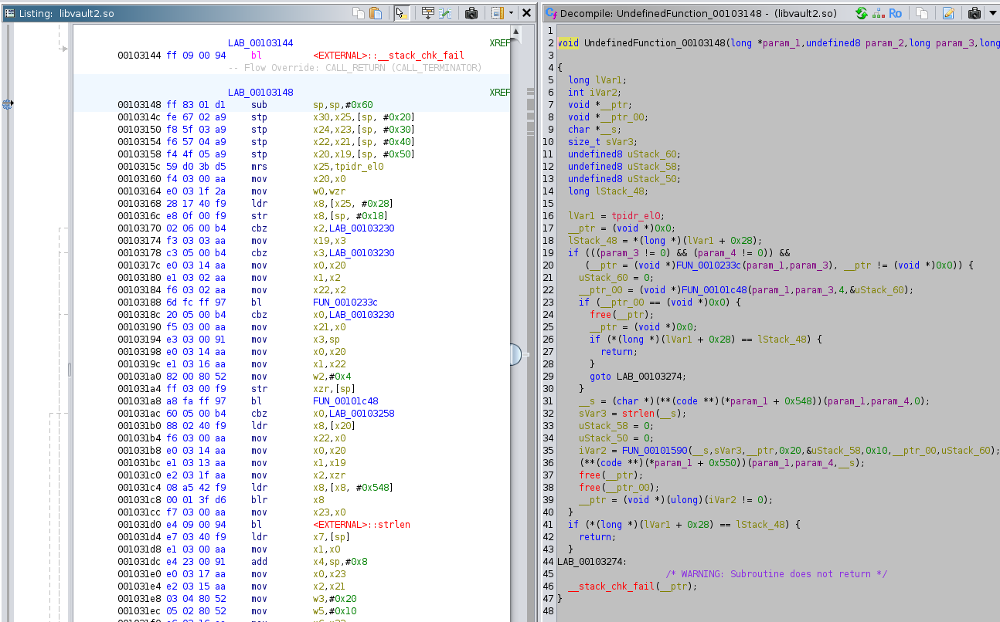

> A threat actor distributed an Android application disguised as an offline password manager called NoctaVault. A secret operational credential is embedded inside, sealed with a recovery phrase. The app uses a custom multi-layer native packer — the real code never touches classes.dex, and every per-build constant in the native library is randomised so no two builds look the same.

The zip file contains the APK `noctavault.apk`
## Methodology
To solve this challenge I used a combination of static analysis with jadx (for the APK and DEX) and Ghidra (for the native library) as well as dynamic analysis with frida, to dump some values at runtime with an old Android device that I rooted. Additionally I used Claude (free version) at various spots to generate scripts or interprete reversed code and analyse the output of tools.  The usage is outlined below.

## Checking functionality of the app

To get a better understanding we run the app and check the functionality. At first we are greeted by a screen to set a master password. Afterwards we got access to our Vault and see there already is a sealed entry, but we can only open it with a recovery phrase.

|  |  |  |
| ---------------------------------------------------------------------------------------- | ---------------------------------------------------------------------------------------- | ---------------------------------------------------------------------------------------- |

## Static analysis
When opening the app in `jadx-gui` we find a few things:
* `io.noctavault.app` contains just one stub class, `StubApp`
* two asset files that seem to contain some raw data: `loader.dat` and `payload.bin`
* the native library `libvault.so`


The main application code is not visible, but `StubApp` overrides the method `attachBaseContext` (inherited by the `Application` class which is a subclass of `ContextWrapper`). This method will be called when the class is initialized and can be used to attach additional context dynamically.

```java
public class StubApp extends Application {
    /* renamed from: b */
    private native void m0b(ClassLoader classLoader);

    /* renamed from: u */
    private native byte[] m1u(Context context);

    static {
        System.loadLibrary("vault");
    }

    @Override // android.content.ContextWrapper
    public void attachBaseContext(Context base) {
        super.attachBaseContext(base);
        try {
            byte[] dex = m1u(base);
            if (dex != null && dex.length > 0) {
                injectDex(base, dex);
                m0b(base.getClassLoader());
            }
        } catch (Throwable th) {
        }
    }
```

We see it calls the native method `u` of `libvault.so` (renamed to `m1u` by jadx), then passes the result to `injectDex` and finally also calls the native method `b`. We haven't analyzed the native methods yet, but we can assume that `u` decrypts one of the assets to a dex, and then loads it into the classes. We could hook `injectDex` with Frida to dump the argument. However, in this case it's easier than that. 

In the `StubApp::injectDex` method, we see it writes the dex bytes to a file `code-cache/ov/.o` before it then uses `DexClassLoader` to load it, and it doesn't remove this file.
```java
public static void injectDex(Context base, byte[] dex) {
	File dir = new File(base.getCodeCacheDir(), "ov");
	if (!dir.exists()) {
		dir.mkdirs();
	}
	File file = new File(dir, ".o");
	FileOutputStream fos = new FileOutputStream(file);
	try {
		fos.write(dex);
		fos.close();
		ClassLoader parent = base.getClassLoader();
		DexClassLoader child = new DexClassLoader(file.getAbsolutePath(), dir.getAbsolutePath(), null, parent);
		Class<?> bdcl = Class.forName("dalvik.system.BaseDexClassLoader");
		Field fPath = bdcl.getDeclaredField("pathList");
		fPath.setAccessible(true);
		Object parentPath = fPath.get(parent);
		Object childPath = fPath.get(child);
		Field fEls = parentPath.getClass().getDeclaredField("dexElements");
		fEls.setAccessible(true);
		Object[] parentEls = (Object[]) fEls.get(parentPath);
		Object[] childEls = (Object[]) fEls.get(childPath);
		Class<?> elType = parentEls.getClass().getComponentType();
		Object merged = Array.newInstance(elType, parentEls.length + childEls.length);
		System.arraycopy(childEls, 0, merged, 0, childEls.length);
		System.arraycopy(parentEls, 0, merged, childEls.length, parentEls.length);
		fEls.set(parentPath, merged);
	} finally {
	}
}
```

We can just run the app and then fetch the file from the device.
## Extracting and analyzing the injected DEX


```shell
┌──(pyvenv)─(kali㉿kali)-[/mnt/…/htb/CTF/CTF-Business2026/mobile_noctavault]
└─$ adb shell
daisy_sprout:/ $ su
daisy_sprout:/ # cd /data/data/io.noctavault.app/
daisy_sprout:/data/data/io.noctavault.app # ls -la
total 44
drwx------   5 u0_a173 u0_a173        4096 2026-05-16 14:18 .
drwxrwx--x 245 system  system        20480 2026-05-16 14:16 ..
drwxrws--x   2 u0_a173 u0_a173_cache  4096 2026-05-16 14:16 cache
drwxrws--x   3 u0_a173 u0_a173_cache  4096 2026-05-16 14:18 code_cache
drwxrwx--x   2 u0_a173 u0_a173        4096 2026-05-16 14:18 shared_prefs
daisy_sprout:/data/data/io.noctavault.app # cd code_cache/
daisy_sprout:/data/data/io.noctavault.app/code_cache # ls -la
total 16
drwxrws--x 3 u0_a173 u0_a173_cache 4096 2026-05-16 14:18 .
drwx------ 5 u0_a173 u0_a173       4096 2026-05-16 14:18 ..
drwx--S--- 3 u0_a173 u0_a173_cache 4096 2026-05-16 14:18 ov
daisy_sprout:/data/data/io.noctavault.app/code_cache # ls -la ov
total 36
drwx--S--- 3 u0_a173 u0_a173_cache  4096 2026-05-16 14:18 .
drwxrws--x 3 u0_a173 u0_a173_cache  4096 2026-05-16 14:18 ..
-rw------- 1 u0_a173 u0_a173_cache 21408 2026-05-16 14:18 .o
drwx--S--- 2 u0_a173 u0_a173_cache  4096 2026-05-16 14:18 oat
```

The file indeed was created in the app directory. Since it lies in the app directory we need `su` to extract it.
```shell
┌──(pyvenv)─(kali㉿kali)-[/mnt/…/htb/CTF/CTF-Business2026/mobile_noctavault]
└─$ adb shell "su -c cat /data/data/io.noctavault.app/code_cache/ov/.o" > dynamic.dex
```

Now we can add it to `jadx-gui` with File -> Add files and get all the actual classes of the app. 


The `VaultActivity` class contains the logic of when this unlock dialog is displayed

```java
    protected void onCreate(Bundle bundle) {
    // [...]
		listView.setOnItemClickListener(new AdapterView.OnItemClickListener() { // from class: io.noctavault.app.ui.VaultActivity$$ExternalSyntheticLambda0
            @Override // android.widget.AdapterView.OnItemClickListener
            public final void onItemClick(AdapterView adapterView, View view, int i, long j) {
                VaultActivity.this.m10lambda$onCreate$0$ionoctavaultappuiVaultActivity(adapterView, view, i, j);
            }
        });
	}
	  /* renamed from: lambda$onCreate$0$io-noctavault-app-ui-VaultActivity, reason: not valid java name */
    /* synthetic */ void m10lambda$onCreate$0$ionoctavaultappuiVaultActivity(AdapterView adapterView, View view, int i, long j) {
        Credential item = this.adapter.getItem(i);
        if (item.kind == Credential.Kind.SEALED && item.password.isEmpty()) {
            showUnlockDialog(item);
        } else {
            openEntry(item.f1id);
        }
    }
```

As we know, the pre-existing entry is sealed and that is why it calls `showUnlockDialog` instead of `openEntry`.

First instinct was to just call `openEntry`, which is possible with frida, however it will not show the password, as the second condition (`item.password.isEmpty()`) already indicates the password isn't stored...

The `showUnlockDialog` creates the dialog that we saw in the app and attaches the following `OnClickListener`

```java
void m13lambda$showUnlockDialog$3$ionoctavaultappuiVaultActivity(EditText editText, TextView textView, Credential credential, AlertDialog alertDialog, View view) {
	String trim = editText.getText().toString().trim();
	if (!NightfallGate.verify(this, trim)) {
		textView.setText(R$string.unlock_dialog_wrong);
		textView.setVisibility(0);
		editText.setText("");
		return;
	}
	credential.password = trim;
	credential.kind = Credential.Kind.NORMAL;
	this.store.update(credential);
	this.adapter.update(this.store.all());
	alertDialog.dismiss();
	Toast.makeText(this, R$string.unlock_dialog_ok, 1).show();
	openEntry(credential.f1id);
}
```

In order to unlock the entry, `NightfallGate.verify` has to return true on our input and then our input will be set as password of the entry, so this should be the flag.

The verify method looks like this:
```java
    public static boolean verify(Activity activity, String str) {
        try {
            if (sLoader == null) {
                return false;
            }
            Object invoke = sLoader.loadClass("io.noctavault.app.secure.R").getDeclaredMethod("n", Context.class, String.class).invoke(null, activity, str);
            if (invoke instanceof Integer) {
                return ((Integer) invoke).intValue() == 1;
            }
            return false;
        } catch (Throwable th) {
            return false;
        }
    }
```
This invokes method `n` of `io.noctavault.app.secure.R`, which we find is a native method (the class was renamed by jadx to `io.noctavault.app.secure.C0000R` and the method to `m2n`)
```java
/* renamed from: io.noctavault.app.secure.R */
/* loaded from: /z/htb/CTF/CTF-Business2026/mobile_noctavault/dynamic.dex */
public final class C0000R {
// [...]
    /* renamed from: n */
    public static native int m2n(Context context, String str);
```

At this point we got all relevant information from the java code and need to dive into the native library to find out what input it accepts.

## Finding `Java_io_noctavault_app_secure_R_n`
When opening `libvault.so` with Ghidra we do not see the JNI method `Java_io_noctavault_app_secure_R_n` 
We can, however, use Frida to hook the registration of native functions to try and find when this happens for `n`: 
https://github.com/lasting-yang/frida_hook_libart/blob/master/hook_RegisterNatives.js

```shell
┌──(.mobile-venv)─(kali㉿kali)-[/mnt/…/htb/CTF/CTF-Business2026/mobile_noctavault]
└─$ frida -l hook-RegisterNatives.js -U -f io.noctavault.app
     ____
    / _  |   Frida 17.9.1 - A world-class dynamic instrumentation toolkit
   | (_| |
    > _  |   Commands:
   /_/ |_|       help      -> Displays the help system
   . . . .       object?   -> Display information about 'object'
   . . . .       exit/quit -> Exit
   . . . .
   . . . .   More info at https://frida.re/docs/home/
   . . . .
   . . . .   Connected to Mi A2 Lite (id=192.168.1.117:5555)
Spawning `io.noctavault.app`...
RegisterNatives is at  0x7508aa58a4 _ZN3art3JNI15RegisterNativesEP7_JNIEnvP7_jclassPK15JNINativeMethodi
Spawned `io.noctavault.app`. Resuming main thread!
[Mi A2 Lite::io.noctavault.app ]-> [RegisterNatives] method_count: 0x1
[RegisterNatives] java_class: io.noctavault.app.secure.R name: n sig: (Landroid/content/Context;Ljava/lang/String;)I fnPtr: 0x749b98e148  fnOffset: 0x749b98e148 libvault.so!0x3148  callee: 0x7508a2d7c4 libart.so!_ZN3art12_GLOBAL__N_18CheckJNI15RegisterNativesEP7_JNIEnvP7_jclassPK15JNINativeMethodi+0x2cc

```

The output tells us `libvault.so!0x3148`, so let's check Ghidra if we can find it there or if we need to dump it from memory somehow.

As Ghidra always has `0x00100000` as offset we go to `0x00103148` (hotkey G and enter `00103148`) and see that Ghidra identifies a function there after clicking the assembly code.


We create a function from it by pressing `F` then press `F` again and rename it to `Java_io_noctavault_app_secure_R_n` 
Lastly, we can make our job a little easier by setting up [JNIAnalyzer](https://github.com/Ayrx/JNIAnalyzer) and adding the correct types to the parameters (`L` to rename and `Ctrl+L` to change type): `Java_io_noctavault_app_secure_R_n(JNIEnv *env,jobject thiz,jobject a0,jstring input_pass)`
The last parameter is our input password.
## Analyzing `Java_io_noctavault_app_secure_R_n` and subsequent methods
We now have to dig through the methods to understand the flow.

The code is heavily obfuscated. At a lot of places we find rolling XOR like this:
```c
  iVar17 = 0xad;
  lVar16 = 0;
  do {
    pcVar1[lVar16] = (&DAT_00100db3)[lVar16] ^ (byte)iVar17;
    iVar15 = (int)lVar16;
    lVar16 = lVar16 + 1;
    iVar17 = iVar15 + iVar17 * 0x11 + -0x62;
  } while (lVar16 != 0x18);
```
We can easily reimplement the decryption with python, but we still need to decrypt each instance manually. For example in this case the data at `DAT_00100db3` is `cc750ed88454d47b5a00687af2df18f7466c8cc6e61d1c9c` and with the key `0xad` the rolling XOR results in the decrypted `"android/context/Context\x00"`. 

Continuing the analysis and deobfuscation we identify the following methods:
* `FUN_0010233c` appears to fetch some information from the APK signature and then at the end calls `FUN_00103ba4`
* `FUN_00103ba4` seems to be `sha256`, consisting of the three parts 
	* `FUN_00103278` (`sha256_init`), which we can identify because the XOR of the data matches exactly the initial hash values of SHA256 (see https://csrc.nist.gov/CSRC/media/Projects/Cryptographic-Standards-and-Guidelines/documents/examples/SHA256.pdf)
		```python
>>> hex(0x8925e13cb582ce3bb667fae4882fed735f70fcb453d36242b5ddaf9d11a7a3aa ^ 0xe32c075b0ee560be8a0909962d6018490e7eaecbc8d60aceaa5e76364a476eb3)
'0x6a09e667bb67ae853c6ef372a54ff53a510e527f9b05688c1f83d9ab5be0cd19'
		``` 
	* `FUN_001035b4` (`sha256_update`)
	* `FUN_001038ac` (`sha256_finalize`)
* `FUN_00101c48` loads an asset, presumably `payload.bin`
* `FUN_00101590` is the verification logic, we'll rename it to `verify`
* `FUN_00104da0` implements a few checks for debugging detection. Without debugging it returns 0, so we should remember that and overwrite the return value to `0` with frida if we use dynamic analysis.
* `FUN_00103c18` seems to be ChaCha20, judging by the bytes `"expand 32-byte k"`...
* I asked claude to explain `FUN_001041f0` and apparently it is a standard implementation of `lz4_decompress`
* `FUN_0010445c` appears to be some kind of custom VM

With all of that, the verfication boils down to this:
* Get information from APK Signature and determine key = SHA256 hash
* Load `/assets/payload.bin`
* Use key from step 1 for ChaCha20 decryption
* LZ4 decompress the result
* Call `FUN_00104400` to set up the initial state for the VM
* Finally call `FUN_0010445c` to execute the decompressed binary in the custom VM.
## Dumping the decompressed VM bytecode

We need to get to the bytecode that is interpreted by the VM. Given the above description it probably is possible to do this statically, but I prefer dumping the memory. In this case I asked claude to generate a frida hook that dumps the VM data, providing it the two methods `FUN_00104400` and `FUN_0010445c`

Also, I added a hook to `FUN_00104da0`/`detect_debugging` and reset the data section at `0x7d50` that is set to the `detect_debugging` return value during `_INIT_0`
```js
setTimeout(() => {
  
  Java.perform(() => {
    var lib = Process.getModuleByName("libvault.so");
    var base = lib.base
    Interceptor.replace(base.add(0x4da0),
      new NativeCallback(function() {
        return 0;
      }, 'uint32', []));

    // Also zero out DAT_00107d50 since _INIT_0 already ran
    base.add(0x7d50).writeU32(0);
  

    Interceptor.attach(base.add(0x4400), {
        onEnter: function(args) {
            console.log("[VM_init] bytecode ptr:", args[1]);
            console.log("[VM_init] bytecode len:", args[2]);
            console.log("[VM_init] param_4 (dict?):", args[3]);
            console.log("[VM_init] param_5 (byte):", args[4]);
            console.log("[VM_init] param_6 (password):", args[5]);
            console.log("[VM_init] param_7:", args[6]);
            console.log("[VM_init] param_8:", args[7]);
            // dump the bytecode
            if (!args[1].isNull() && !args[2].isNull()) {
                console.log(hexdump(args[1], { length: args[2].toInt32() }));
            }
        }
    });
  });
}, 2000)

```

After running it on the device and triggering the verification by entering a password, the state is dumped:
```shell
┌──(.mobile-venv)─(kali㉿kali)-[/z/htb/CTF/CTF-Business2026/mobile_noctavault]
└─$ frida -l dump-vm.js -U -f io.noctavault.app
     ____
    / _  |   Frida 17.9.1 - A world-class dynamic instrumentation toolkit
   | (_| |
    > _  |   Commands:
   /_/ |_|       help      -> Displays the help system
   . . . .       object?   -> Display information about 'object'
   . . . .       exit/quit -> Exit
   . . . .
   . . . .   More info at https://frida.re/docs/home/
   . . . .
   . . . .   Connected to Mi A2 Lite (id=192.168.1.117:5555)
Spawned `io.noctavault.app`. Resuming main thread!
[Mi A2 Lite::io.noctavault.app ]-> [VM_init] bytecode ptr: 0x7499745000
[VM_init] bytecode len: 0x1e62
[VM_init] param_4 (dict?): 0x749acdd80c
[VM_init] param_5 (byte): 0xa
[VM_init] param_6 (password): 0x749acdd94c
[VM_init] param_7: 0x749969fa40
[VM_init] param_8: 0x4
             0  1  2  3  4  5  6  7  8  9  A  B  C  D  E  F  0123456789ABCDEF
7499745000  0e 01 00 02 02 00 00 00 00 19 02 01 0e 01 01 02  ................
7499745010  02 01 00 00 00 19 02 01 0e 01 02 02 02 02 00 00  ................
7499745020  00 19 02 01 0e 01 03 02 02 03 00 00 00 19 02 01  ................
7499745030  0e 01 04 02 02 04 00 00 00 19 02 01 0e 01 05 02  ................
7499745040  02 05 00 00 00 19 02 01 0e 01 06 02 02 06 00 00  ................
7499745050  00 19 02 01 0e 01 07 02 02 07 00 00 00 19 02 01  ................
7499745060  0e 01 08 02 02 08 00 00 00 19 02 01 0e 01 09 02  ................
7499745070  02 09 00 00 00 19 02 01 0e 01 0a 02 02 0a 00 00  ................
[...]
7499746e50  00 00 1a 05 04 02 04 5f 00 00 00 19 04 05 1d 1f  ......._........
7499746e60  1c 1f                                            ..
```

I copied the hexdump to a file and converted it to bytes with `xxd`
```shell
┌──(.mobile-venv)─(kali㉿kali)-[/mnt/…/htb/CTF/CTF-Business2026/mobile_noctavault]
└─$ xxd -r hexdump.txt > dump.bin
```

## Disassembling and analyzing the VM code

Now that we have the VM bytecode we can try to understand what it does, but doing this manually by going through the bytecode and the parsing logic is tedious. Instead I asked claude to write a disassembler for it:

```python
#!/usr/bin/env python3
"""
Disassembler for the custom VM in libvault.so (FUN_0010445c).

VM State Layout (param_1 / auStack_2a8):
  +0x00  : code_ptr        — pointer to bytecode buffer
  +0x08  : code_len        — length of bytecode (uint64)
  +0x10  : scratch_ptr     — pointer to expected-answer table (array of 0x20-byte entries)
  +0x18  : num_answers     — number of entries in scratch_ptr table (uint8 at +0x17)
  +0x20  : reg_table_ptr   — pointer to register-initialisation table (array of uint32s at indices)
  +0x28  : input_ptr       — pointer to the user-supplied input buffer
  +0x30  : input_len       — length of user input (uint64)

  +0x38 .. +0x78  : registers R0..R15  (16 × uint32, each at offset 0x38 + idx*4)
  +0x78 .. +0x178 : scratch memory    (256 bytes of working RAM, "mem[]")
  +0x17a : flag_cmp        — result of the last CMP/CMPI instruction (bool)
  +0x17b : flag_halt       — set to 1 to stop the VM loop (halt / error)
  +0x17c : flag_success    — set to 1 when the answer is confirmed correct
  +0x17d : flag_error      — set to 1 on an illegal opcode (also sets flag_halt)
  +0x178 : PC              — program counter (uint16 at param_1 + 0x2f*8 = offset 0x178)

Instruction encoding (variable length):
  [opcode: 1 byte] [operands …]

  Most 2-operand register instructions are 3 bytes:
    opcode  dst_reg  src_reg
  where the register index is the low nibble of the operand byte.

Usage:
  python3 vm_disasm.py <bytecode_file>

The bytecode file is the raw decompressed binary you dumped from the VM.
"""

import sys
import struct

# ── helpers ────────────────────────────────────────────────────────────────────

def reg(b):
    return f"R{b & 0xf}"

def u32(data, off):
    return struct.unpack_from("<I", data, off)[0]

def s16(data, off):
    return struct.unpack_from("<h", data, off)[0]

def u16(data, off):
    return struct.unpack_from("<H", data, off)[0]

# ── disassembler ───────────────────────────────────────────────────────────────

def disassemble(data: bytes) -> list[tuple[int, str, str]]:
    """
    Returns a list of (offset, mnemonic, comment) tuples.
    """
    rows = []
    pc = 0
    n = len(data)

    while pc < n:
        base = pc
        op = data[pc]
        pc += 1

        def need(k):
            """Ensure we have k more bytes."""
            if pc + k > n:
                raise IndexError(f"truncated at 0x{base:04x}")

        try:
            # ── opcode table ────────────────────────────────────────────────
            if op == 0x00:
                # NOP
                mnem = "NOP"
                cmt  = "No operation"

            elif op == 0x01:
                # MOV Rd, [Rs_lo_nibble * 4 + reg_table]
                # actually: Rd = mem[R<src_lo>]  (indirect from internal scratch at +0x78)
                # Looking at code: reads byte at lVar12 + uVar1 (dst), then reads
                # from param_1[4] which is reg_table_ptr.
                # Encoding: opcode dst src   (3 bytes total)
                need(2)
                dst = data[pc] & 0xf;  pc += 1
                src = data[pc] & 0xf;  pc += 1
                mnem = f"LOAD_TAB {reg(dst)}, TAB[{reg(src)}]"
                cmt  = (f"{reg(dst)} = reg_init_table[{reg(src)}]  "
                        f"— load a pre-seeded uint32 from the register-initialisation table "
                        f"indexed by the low byte of {reg(src)}")

            elif op == 0x02:
                # MOVI Rd, imm32
                # Encoding: opcode dst imm32le  (6 bytes total)
                need(5)
                dst  = data[pc] & 0xf;  pc += 1
                imm  = u32(data, pc);   pc += 4
                mnem = f"MOVI {reg(dst)}, 0x{imm:08x}"
                cmt  = f"{reg(dst)} = 0x{imm:08x}  ({imm})  — move immediate 32-bit constant"

            elif op == 0x03:
                # ADD Rd, Rs
                need(2)
                dst = data[pc] & 0xf;  pc += 1
                src = data[pc] & 0xf;  pc += 1
                mnem = f"ADD {reg(dst)}, {reg(src)}"
                cmt  = f"{reg(dst)} += {reg(src)}  (signed 32-bit)"

            elif op == 0x04:
                # SUB Rd, Rs
                need(2)
                dst = data[pc] & 0xf;  pc += 1
                src = data[pc] & 0xf;  pc += 1
                mnem = f"SUB {reg(dst)}, {reg(src)}"
                cmt  = f"{reg(dst)} -= {reg(src)}  (signed 32-bit)"

            elif op == 0x05:
                # XOR Rd, Rs
                need(2)
                dst = data[pc] & 0xf;  pc += 1
                src = data[pc] & 0xf;  pc += 1
                mnem = f"XOR {reg(dst)}, {reg(src)}"
                cmt  = f"{reg(dst)} ^= {reg(src)}"

            elif op == 0x06:
                # AND Rd, Rs
                need(2)
                dst = data[pc] & 0xf;  pc += 1
                src = data[pc] & 0xf;  pc += 1
                mnem = f"AND {reg(dst)}, {reg(src)}"
                cmt  = f"{reg(dst)} &= {reg(src)}"

            elif op == 0x07:
                # OR Rd, Rs
                need(2)
                dst = data[pc] & 0xf;  pc += 1
                src = data[pc] & 0xf;  pc += 1
                mnem = f"OR  {reg(dst)}, {reg(src)}"
                cmt  = f"{reg(dst)} |= {reg(src)}"

            elif op == 0x08:
                # MUL Rd, Rs
                need(2)
                dst = data[pc] & 0xf;  pc += 1
                src = data[pc] & 0xf;  pc += 1
                mnem = f"MUL {reg(dst)}, {reg(src)}"
                cmt  = f"{reg(dst)} *= {reg(src)}  (signed 32-bit)"

            elif op == 0x09:
                # ROTR Rd, Rs   (rotate right by (-Rs & 0x1f) == rotate left by Rs&0x1f)
                # The C code: shift = (-Rs) & 0x1f → effectively ROL by Rs
                need(2)
                dst = data[pc] & 0xf;  pc += 1
                src = data[pc] & 0xf;  pc += 1
                mnem = f"ROL {reg(dst)}, {reg(src)}"
                cmt  = (f"{reg(dst)} = rotl32({reg(dst)}, {reg(src)} & 0x1f)  "
                        f"— rotate-left (implemented as rotr with negated count)")

            elif op == 0x0a:
                # ROTR Rd, Rs  (rotate right by Rs & 0x1f)
                need(2)
                dst = data[pc] & 0xf;  pc += 1
                src = data[pc] & 0xf;  pc += 1
                mnem = f"ROR {reg(dst)}, {reg(src)}"
                cmt  = f"{reg(dst)} = rotr32({reg(dst)}, {reg(src)} & 0x1f)"

            elif op == 0x0b:
                # NOT Rd
                # Encoding: opcode reg_byte  (2 bytes; only low nibble used)
                need(1)
                dst = data[pc] & 0xf;  pc += 1
                mnem = f"NOT {reg(dst)}"
                cmt  = f"{reg(dst)} = ~{reg(dst)}"

            elif op == 0x0c:
                # SHL Rd, imm5
                # Encoding: opcode dst imm   (3 bytes; shift amount = imm & 0x1f)
                need(2)
                dst   = data[pc] & 0xf;  pc += 1
                shift = data[pc] & 0x1f; pc += 1
                mnem  = f"SHL {reg(dst)}, {shift}"
                cmt   = f"{reg(dst)} <<= {shift}"

            elif op == 0x0d:
                # SHR Rd, imm5  (logical shift right)
                need(2)
                dst   = data[pc] & 0xf;  pc += 1
                shift = data[pc] & 0x1f; pc += 1
                mnem  = f"SHR {reg(dst)}, {shift}"
                cmt   = f"{reg(dst)} >>= {shift}  (unsigned / logical)"

            elif op == 0x0e:
                # LOAD_INPUT_BYTE  Rd, imm_offset
                # Loads a single byte from the input buffer at byte offset given by an immediate.
                # Encoding: opcode dst imm_offset  (3 bytes)
                need(2)
                dst    = data[pc] & 0xf;  pc += 1
                offset = data[pc];        pc += 1
                mnem   = f"LDB {reg(dst)}, INPUT[0x{offset:02x}]"
                cmt    = (f"{reg(dst)} = (uint8) input[0x{offset:02x}]  "
                          f"(0 if offset >= input_len)")

            elif op == 0x0f:
                # LOAD_INPUT_DWORD  Rd, imm_offset
                # Loads a little-endian uint32 from the input buffer.
                # Encoding: opcode dst imm_offset  (3 bytes)
                need(2)
                dst    = data[pc] & 0xf;  pc += 1
                offset = data[pc];        pc += 1
                mnem   = f"LDW {reg(dst)}, INPUT[0x{offset:02x}]"
                cmt    = (f"{reg(dst)} = (uint32le) input[0x{offset:02x}..+3]  "
                          f"(0 if out-of-bounds)")

            elif op == 0x10:
                # LOAD_REG_TABLE  Rd, TAB[imm_idx]
                # Loads uint32 directly from the register-init table using an immediate index.
                # Encoding: opcode dst imm_idx  (3 bytes)
                need(2)
                dst = data[pc] & 0xf;  pc += 1
                idx = data[pc];        pc += 1
                mnem = f"LOAD_TAB {reg(dst)}, TAB[0x{idx:02x}]"
                cmt  = f"{reg(dst)} = reg_init_table[0x{idx:02x}]  (immediate table index)"

            elif op == 0x11:
                # CMP Rd, Rs   — compare two registers, store bool in flag_cmp
                need(2)
                r1 = data[pc] & 0xf;  pc += 1
                r2 = data[pc] & 0xf;  pc += 1
                mnem = f"CMP {reg(r1)}, {reg(r2)}"
                cmt  = f"flag_cmp = ({reg(r1)} == {reg(r2)})"

            elif op == 0x12:
                # CMPI Rd, imm32  — compare register to immediate
                # Encoding: opcode dst imm32le  (6 bytes)
                need(5)
                dst = data[pc] & 0xf;  pc += 1
                imm = u32(data, pc);   pc += 4
                mnem = f"CMPI {reg(dst)}, 0x{imm:08x}"
                cmt  = f"flag_cmp = ({reg(dst)} == 0x{imm:08x})  ({imm})"

            elif op == 0x13:
                # JNE rel16  — jump if NOT equal (flag_cmp == 0)
                # Encoding: opcode rel_lo rel_hi  (3 bytes; signed 16-bit offset from end of instr)
                need(2)
                rel = s16(data, pc);  pc += 2
                target = pc + rel
                mnem = f"JNE 0x{target:04x}  ({rel:+d})"
                cmt  = f"if !flag_cmp: PC = 0x{target:04x}"

            elif op == 0x14:
                # JE rel16  — jump if equal (flag_cmp != 0)
                need(2)
                rel = s16(data, pc);  pc += 2
                target = pc + rel
                mnem = f"JE  0x{target:04x}  ({rel:+d})"
                cmt  = f"if flag_cmp: PC = 0x{target:04x}"

            elif op == 0x15:
                # JMP rel16  — unconditional relative jump
                need(2)
                rel = s16(data, pc);  pc += 2
                target = pc + rel
                mnem = f"JMP 0x{target:04x}  ({rel:+d})"
                cmt  = f"PC = 0x{target:04x}  (unconditional)"

            elif op == 0x16:
                # SHA256_INIT  — initialise the embedded SHA-256 context
                mnem = "SHA256_INIT"
                cmt  = "initialise the VM's built-in SHA-256 state"

            elif op == 0x17:
                # SHA256_UPDATE Rd, imm_len
                # Feeds mem[Rd .. Rd+imm_len-1] into the SHA-256 state.
                # Encoding: opcode src_reg imm_len  (3 bytes)
                need(2)
                src = data[pc] & 0xf;  pc += 1
                length = data[pc];     pc += 1
                mnem = f"SHA256_UPDATE {reg(src)}, {length}"
                cmt  = (f"sha256_update(mem[{reg(src)} .. {reg(src)}+{length}-1])  "
                        f"— only executed when {reg(src)} + {length} <= 0x100")

            elif op == 0x18:
                # SHA256_FINAL Rs
                # Finalises the SHA-256 digest and writes all 32 bytes into mem[Rs..Rs+31].
                # Encoding: opcode src_reg  (2 bytes; src_reg holds the memory address)
                need(1)
                dst = data[pc] & 0xf;  pc += 1
                mnem = f"SHA256_FINAL {reg(dst)}"
                cmt  = (f"sha256_final() → 32 bytes written to mem[{reg(dst)} .. {reg(dst)}+31]  "
                        f"(only if {reg(dst)} < 0xe1)")

            elif op == 0x19:
                # STORE_BYTE  [Rd], Rs
                # mem[Rd] = (uint8) Rs
                # Encoding: opcode dst_addr_reg src_reg  (3 bytes)
                need(2)
                addr_r = data[pc] & 0xf;  pc += 1
                src_r  = data[pc] & 0xf;  pc += 1
                mnem   = f"STB [{reg(addr_r)}], {reg(src_r)}"
                cmt    = f"mem[{reg(addr_r)}] = (uint8){reg(src_r)}"

            elif op == 0x1a:
                # LOAD_MEM_BYTE  Rd, [Rs]
                # Rd = (uint8) mem[Rs]   (zero-extended to uint32)
                # Encoding: opcode dst src_addr_reg  (3 bytes)
                need(2)
                dst    = data[pc] & 0xf;  pc += 1
                addr_r = data[pc] & 0xf;  pc += 1
                mnem   = f"LDB {reg(dst)}, [{reg(addr_r)}]"
                cmt    = f"{reg(dst)} = (uint8) mem[{reg(addr_r)}]  (indirect load from scratch RAM)"

            elif op == 0x1b:
                # CHECK  Rd, len, answer_idx
                # Compares len bytes starting at mem[Rd] against the expected answer
                # stored in scratch_ptr[answer_idx] (each entry is 0x20 bytes).
                # Sets flag_cmp = 1 if all bytes match, 0 otherwise.
                # Special: len == 0 sets flag_cmp = 1 immediately (trivially true).
                # Aborts with error if answer_idx >= num_answers or len > 0x20.
                # Uses NEON byte-by-byte equality for lengths 1-7, word-level NEON
                # for 8-15, and 16-byte NEON chunks for 16-32.
                # Encoding: opcode addr_reg len answer_idx  (4 bytes)
                need(3)
                addr_r     = data[pc] & 0xf;  pc += 1
                length     = data[pc];         pc += 1
                answer_idx = data[pc];         pc += 1
                mnem = f"CHECK [{reg(addr_r)}], len={length}, answer[{answer_idx}]"
                cmt  = (f"flag_cmp = (mem[{reg(addr_r)} .. {reg(addr_r)}+{length}-1] "
                        f"== expected_answers[{answer_idx}][0..{length}-1])  "
                        f"— error if {answer_idx} >= num_answers or {length} > 0x20")

            elif op == 0x1c:
                # HALT  — stop the VM (set flag_halt); this is the failure/reject path
                mnem = "HALT"
                cmt  = "set flag_halt = 1  — VM stops, validation FAILS"

            elif op == 0x1d:
                # SUCCESS  — flag that the input is valid; VM still runs until HALT/end
                mnem = "SUCCESS"
                cmt  = "set flag_success = 1  — validation PASSES when VM ends"

            elif op == 0x1e:
                # GET_INPUT_LEN  Rd
                # Loads the length of the user-input buffer into Rd.
                # Encoding: opcode dst  (2 bytes)
                need(1)
                dst  = data[pc] & 0xf;  pc += 1
                mnem = f"GET_INPUT_LEN {reg(dst)}"
                cmt  = f"{reg(dst)} = input_len"

            elif op == 0x1f:
                # ERROR  — set flag_error AND flag_halt; VM is done
                mnem = "ERROR"
                cmt  = "set flag_error = flag_halt = 1  — illegal-opcode trap"

            else:
                # Unknown — treat like ERROR per the default case in the switch
                mnem = f"UNKNOWN_OP 0x{op:02x}"
                cmt  = "unrecognised opcode → sets flag_halt + flag_error"

        except IndexError as e:
            rows.append((base, f"<truncated>  ; {e}", ""))
            break

        rows.append((base, mnem, cmt))

    return rows


# ── output ─────────────────────────────────────────────────────────────────────

def print_disasm(rows):
    print(f"{'Offset':<8}  {'Instruction':<44}  Comment")
    print("-" * 100)
    for (off, mnem, cmt) in rows:
        print(f"0x{off:04x}    {mnem:<44}  ; {cmt}")


def main():
    if len(sys.argv) < 2:
        print("Usage: python3 vm_disasm.py <bytecode_file>")
        print()
        print("Disassembler for the custom VM in libvault.so (FUN_0010445c).")
        print("Feed it the raw decompressed bytecode blob you dumped.")
        sys.exit(1)

    with open(sys.argv[1], "rb") as f:
        data = f.read()

    print(f"; VM bytecode — {len(data)} bytes")
    print(f"; Disassembled with vm_disasm.py")
    print()
    rows = disassemble(data)
    print_disasm(rows)


if __name__ == "__main__":
    main()
```

Calling the script gives us the disassembled VM code:

```shell
┌──(.mobile-venv)─(kali㉿kali)-[/mnt/…/htb/CTF/CTF-Business2026/mobile_noctavault]
└─$ python ./vm-disasm-claude.py dump.bin
; VM bytecode — 7778 bytes
; Disassembled with vm_disasm.py

Offset    Instruction                                   Comment
----------------------------------------------------------------------------------------------------
0x0000    LDB R1, INPUT[0x00]                           ; R1 = (uint8) input[0x00]  (0 if offset >= input_len)
0x0003    MOVI R2, 0x00000000                           ; R2 = 0x00000000  (0)  — move immediate 32-bit constant
0x0009    STB [R2], R1                                  ; mem[R2] = (uint8)R1
0x000c    LDB R1, INPUT[0x01]                           ; R1 = (uint8) input[0x01]  (0 if offset >= input_len)
0x000f    MOVI R2, 0x00000001                           ; R2 = 0x00000001  (1)  — move immediate 32-bit constant
0x0015    STB [R2], R1                                  ; mem[R2] = (uint8)R1
[...]
0x1e5e    SUCCESS                                       ; set flag_success = 1  — validation PASSES when VM ends
0x1e5f    ERROR                                         ; set flag_error = flag_halt = 1  — illegal-opcode trap
0x1e60    HALT                                          ; set flag_halt = 1  — VM stops, validation FAILS
0x1e61    ERROR                                         ; set flag_error = flag_halt = 1  — illegal-opcode trap
```

The VM bytecode does the following:
- Copy the input bytes 0-0x2e (Note: this indicates the flag has length 0x2e )
- Load hardcoded 32 bytes
- Call `FUN_0010333c`, which claude called `sha256_init`......... More about this later...
- Call `sha256_update` and `sha256_finalize` 5 letters of the flag at a time together with previous 32bytes
- Compare it to predefined hashes... however these hashes are not in the bytecode...

## Finding the expected hashes
Again we can use frida to dump the expected hashes at runtime, for which I asked claude to generate a frida hook:
```js
/**
 * Frida hook for libvault.so :: FUN_00104400  (VM initialiser)
 *
 * AArch64 argument registers at entry:
 *   x0  param_1  VM state buffer (auStack_2a8 on caller's stack)
 *   x1  param_2  code_ptr        — pointer to decompressed VM bytecode
 *   x2  param_3  code_len        — length of bytecode in bytes
 *   x3  param_4  scratch_ptr     — __ptr_00 + 3, points to answer table
 *                                  layout: num_answers × 0x20-byte SHA-256 digests
 *   x4  param_5  num_answers     — byte; how many entries in the answer table
 *   x5  param_6  reg_table_ptr   — pointer to uint32 initialisation table
 *   x6  param_7  input_ptr       — pointer to the user-supplied input string
 *   x7  param_8  input_len       — length of user input
 *
 * From bytecode analysis:
 *   - 10 CHECK instructions → 10 answer entries
 *   - each entry is 32 bytes (SHA-256 digest)
 *   - answer table total = 10 × 32 = 320 bytes
 *   - flag is 47 bytes long (input[0x00..0x2e], last chunk is 2 bytes not 5)
 *   - hardcoded mixing blob (mem[0x60..0x7f]) is embedded in bytecode
 *
 * Usage:
 *   frida -U -f com.example.vault -l hook_vault.js --no-pause
 *   # or attach if already running:
 *   frida -U com.example.vault -l hook_vault.js
 */
 
'use strict';
 
// ── config ────────────────────────────────────────────────────────────────────
 
const LIB_NAME      = 'libvault.so';   // exact .so name as it appears in /proc/maps
const FUNC_OFFSET   = 0x4400;        // FUN_00104400 — offset from lib base
const NUM_ANSWERS   = 10;              // from bytecode: CHECK instructions 0..9
const ANSWER_SIZE   = 32;             // SHA-256 digest length
const FLAG_LEN      = 47;             // input[0x00..0x2e] — last window is 2 bytes
 
// ── helpers ───────────────────────────────────────────────────────────────────
 
function hexdump_compact(ptr, len, label) {
    const bytes = ptr.readByteArray(len);
    const arr   = new Uint8Array(bytes);
    const hex   = Array.from(arr).map(b => b.toString(16).padStart(2, '0')).join('');
    console.log(`  ${label}: ${hex}`);
}
 
function bytes_to_hex(ptr, len) {
    const arr = new Uint8Array(ptr.readByteArray(len));
    return Array.from(arr).map(b => b.toString(16).padStart(2, '0')).join('');
}
 
function try_read_string(ptr, max_len) {
    try {
        // try UTF-8 first (flag is printable ASCII)
        const s = ptr.readUtf8String(max_len);
        // only return if all bytes are printable
        if (/^[\x20-\x7e]*$/.test(s)) return JSON.stringify(s);
    } catch (_) {}
    return null;
}
 
// ── main hook ─────────────────────────────────────────────────────────────────
 
function install_hook() {
    // Wait for the library to be loaded
    const lib = Process.findModuleByName(LIB_NAME);
    if (!lib) {
        console.error(`[!] ${LIB_NAME} not loaded yet — retrying via Module.load hook`);
        return false;
    }
 
    var base = lib.base
    Interceptor.replace(base.add(0x4da0), // adjust to actual offset of detect_root_and_emulator
      new NativeCallback(function() {
        return 0;
      }, 'uint32', []));

    // Also zero out DAT_00107d50 since _INIT_0 already ran
    base.add(0x7d50).writeU32(0);
  
    const func_addr = lib.base.add(FUNC_OFFSET);
    console.log(`[+] ${LIB_NAME} base : ${lib.base}`);
    console.log(`[+] FUN_00104400    : ${func_addr}`);
 
    Interceptor.attach(func_addr, {
        onEnter(args) {
            console.log('\n' + '═'.repeat(72));
            console.log('[FUN_00104400] VM initialiser called');
            console.log('─'.repeat(72));
 
            // ── raw register dump ────────────────────────────────────────────
            const vm_state_ptr  = args[0];   // x0
            const code_ptr      = args[1];   // x1
            const code_len      = args[2].toUInt32();  // x2
            const scratch_ptr   = args[3];   // x3  ← ANSWER TABLE
            const num_answers   = args[4].toUInt32() & 0xff;  // x4 (byte)
            const reg_table_ptr = args[5];   // x5
            const input_ptr     = args[6];   // x6
            const input_len     = args[7].toUInt32();  // x7
 
            console.log(`  vm_state_ptr  = ${vm_state_ptr}`);
            console.log(`  code_ptr      = ${code_ptr}  (bytecode, ${code_len} bytes)`);
            console.log(`  scratch_ptr   = ${scratch_ptr}  (answer table)`);
            console.log(`  num_answers   = ${num_answers}  (expected: ${NUM_ANSWERS})`);
            console.log(`  reg_table_ptr = ${reg_table_ptr}`);
            console.log(`  input_ptr     = ${input_ptr}  (len=${input_len}, expected: ${FLAG_LEN})`);
 
            // ── input string ─────────────────────────────────────────────────
            console.log('\n[INPUT]');
            if (!input_ptr.isNull() && input_len > 0) {
                const input_hex = bytes_to_hex(input_ptr, input_len);
                const input_str = try_read_string(input_ptr, input_len);
                console.log(`  hex : ${input_hex}`);
                if (input_str) console.log(`  str : ${input_str}`);
                console.log(`  len : ${input_len} (flag expects ${FLAG_LEN})`);
            } else {
                console.log('  (null or zero-length)');
            }
 
            // ── answer table dump ─────────────────────────────────────────────
            console.log('\n[ANSWER TABLE]  (scratch_ptr → SHA-256 expected digests)');
            if (scratch_ptr.isNull()) {
                console.log('  (null pointer — asset decryption may have failed)');
            } else {
                const effective_count = Math.min(num_answers || NUM_ANSWERS, NUM_ANSWERS);
                for (let i = 0; i < effective_count; i++) {
                    const entry_ptr = scratch_ptr.add(i * ANSWER_SIZE);
                    hexdump_compact(entry_ptr, ANSWER_SIZE, `answer[${i}]`);
                }
            }
 
            // ── reg init table ───────────────────────────────────────────────
            // The bytecode uses LOAD_TAB with indices 0..N; dump first 32 uint32s
            console.log('\n[REG INIT TABLE]  (reg_table_ptr → pre-seeded uint32s)');
            if (!reg_table_ptr.isNull()) {
                const REG_TABLE_ENTRIES = 32;
                const row = [];
                for (let i = 0; i < REG_TABLE_ENTRIES; i++) {
                    const v = reg_table_ptr.add(i * 4).readU32();
                    row.push(`[${i}]=0x${v.toString(16).padStart(8,'0')}`);
                }
                // print 4 per line
                for (let i = 0; i < REG_TABLE_ENTRIES; i += 4) {
                    console.log('  ' + row.slice(i, i + 4).join('  '));
                }
            } else {
                console.log('  (null)');
            }
 
            // ── bytecode preview ─────────────────────────────────────────────
            console.log('\n[BYTECODE]');
            const preview = Math.min(code_len, 32);
            console.log(`  first ${preview} bytes: ${bytes_to_hex(code_ptr, preview)}`);
            console.log(`  total size          : ${code_len} bytes`);
 
            console.log('═'.repeat(72) + '\n');
 
            // ── stash for onLeave if needed ───────────────────────────────────
            this.scratch_ptr   = scratch_ptr;
            this.num_answers   = num_answers;
            this.input_ptr     = input_ptr;
            this.input_len     = input_len;
        },
 
        onLeave(_retval) {
            // FUN_00104400 is void, nothing to inspect in retval.
            // The VM execution happens in the subsequent FUN_0010445c call.
        }
    });
 
    console.log('[+] Hook installed — trigger the flag-check in the app now\n');
    return true;
}
 
// ── entry point ───────────────────────────────────────────────────────────────
 
// Try immediately (if lib is already mapped)
if (!install_hook()) {
    // Fall back: watch for dlopen
    Interceptor.attach(Module.getGlobalExportByName('android_dlopen_ext') ||
                       Module.getGlobalExportByName('dlopen'), {
        onLeave(_retval) {
            install_hook();
        }
    });
}
```

```shell
┌──(.mobile-venv)─(kali㉿kali)-[/mnt/…/htb/CTF/CTF-Business2026/mobile_noctavault]
└─$ frida -l hook-vm-hashes.js -U -f io.noctavault.app
     ____
    / _  |   Frida 17.9.1 - A world-class dynamic instrumentation toolkit
   | (_| |
    > _  |   Commands:
   /_/ |_|       help      -> Displays the help system
   . . . .       object?   -> Display information about 'object'
   . . . .       exit/quit -> Exit
   . . . .
   . . . .   More info at https://frida.re/docs/home/
   . . . .
   . . . .   Connected to Mi A2 Lite (id=192.168.1.117:5555)
Spawning `io.noctavault.app`...
[+] libvault.so base : 0x749b9a5000
[+] FUN_00104400    : 0x749b9a9400
[+] Hook installed — trigger the flag-check in the app now
════════════════════════════════════════════════════════════════════════
[FUN_00104400] VM initialiser called
────────────────────────────────────────────────────────────────────────
  vm_state_ptr  = 0x7ff368c9d8
  code_ptr      = 0x747eff7000  (bytecode, 7778 bytes)
  scratch_ptr   = 0x747f22800c  (answer table)
  num_answers   = 10  (expected: 10)
  reg_table_ptr = 0x747f22814c
  input_ptr     = 0x747f219a70  (len=4, expected: 47)

[INPUT]
  hex : 74657374
  str : "test"
  len : 4 (flag expects 47)

[ANSWER TABLE]  (scratch_ptr → SHA-256 expected digests)
  answer[0]: 38ac8008d73d409129ae8046757f47a4a54d31161c890b0721d99c4d4b67b7bc
  answer[1]: ae6e54655c2b7c353c9b0a06c17d72af6e9b079d5247719a7a717059e367f43a
  answer[2]: e0576ee2173774e47807b8f47d806e8437f30c502145dcf76709cefe622afded
  answer[3]: 727014ca9191a6e9658987e3269cfeeac703cc64157a958c6c5a2ae467d786d7
  answer[4]: 088275906a19a5bf8d73f2804e10fa633d2eaf6bf82c152db937c5fee989fd33
  answer[5]: b7357f7119f2a610d67431f36614e83b9360318e7649d6aa2cbce5de1d6b9e36
  answer[6]: 60f51563cd26715d19d1d665ce34aad65ef0a5f848192d0e12b4417c71a2c689
  answer[7]: 7fde459c4e57ce128fac84a6c3aa5912bca73c2631324c1fa9fa30d43665ee3a
  answer[8]: f3f4399d9435dc75e54a58f371512535c5e66077f9bdc2426f25275c7824b4dd
  answer[9]: 66a0be9396f68bdef5502503fccba96a790c06ca18790c9ccf6af4bfe2ffeead

[REG INIT TABLE]  (reg_table_ptr → pre-seeded uint32s)
  [0]=0x3bcc10c1  [1]=0x535f932e  [2]=0x224357eb  [3]=0x53ad9b14
  [4]=0xa2858635  [5]=0x9fbde185  [6]=0x2429ce64  [7]=0xdea4d936
  [8]=0xca047fb4  [9]=0x640c3b89  [10]=0x8cacb645  [11]=0xd307ad3c
  [12]=0x0b6934c9  [13]=0x1004c02a  [14]=0xc22a566b  [15]=0x8c59b227
  [16]=0x7015ff53  [17]=0x944107cd  [18]=0x923e2dd6  [19]=0x6ac24db2
  [20]=0xd23f5c12  [21]=0x702335c2  [22]=0xbc84fae7  [23]=0x41789a34
  [24]=0x1473cd8a  [25]=0x2c294bb2  [26]=0x7fe77483  [27]=0xe3b06726
  [28]=0xd4287803  [29]=0x3cc6d496  [30]=0x70c32b45  [31]=0x5ebdaeaa

[BYTECODE]
  first 32 bytes: 0e01000202000000001902010e01010202010000001902010e01020202020000
  total size          : 7778 bytes
════════════════════════════════════════════════════════════════════════


```

Now we can try to bruteforce the hashes, with one problem... 

## Brute forcing flag parts

Remember that claude called `FUN_0010333c` `sha256_init` in the disassembler... However, it turned out to have different initalization vectors.
```c
void FUN_0010333c(undefined4 *param_1)

{
  *param_1 = 0xe32c075b;
  param_1[1] = 0xee560be;
  param_1[2] = 0x8a090996;
  param_1[3] = 0x2d601849;
  param_1[4] = 0xe7eaecb;
  param_1[5] = 0xc8d60ace;
  param_1[6] = 0xaa5e7636;
  *(undefined8 *)(param_1 + 8) = 0;
  *(undefined8 *)(param_1 + 0x1a) = 0;
  param_1[7] = 0x4a476eb3;
  return;
}
```

Feeding all of this into claude it generated a bruteforce script to crack the flag